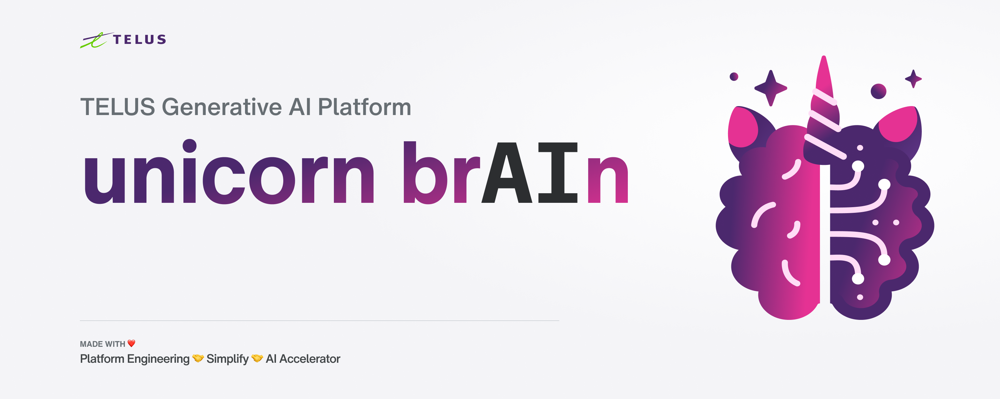

# Unicorn Brain - TELUS' Generative AI Platform

[](https://verbose-dollop-35wv474.pages.github.io/)


Generative AI is a game-changer for TELUS! It has countless use cases that can bring immense value to both our internal teams and our customers.

unicorn.brain is TELUS' common Generative AI Platform that enables experimentation, rapid prototyping and building out gen AI solutions for TELUS in a shared, and safe way!

This repo currently hosts the unicorn.brain API, the platform's front door to interact with LLMs, and our shared gen AI infrastructure in GCP! Currently we are working with the GPT models from OpenAI through Azure deployments, and Milvus as our vector database.

### :icecream: Who's using this?

- Simplify Hub - [website](https://simplify.telus.com/gpt), [repo](https://github.com/telus/simplify)
- Unicorn.AI - [Slack channel](https://telus-cdo.slack.com/archives/C050ZCE7VTN), [repo](https://github.com/telus/unicorn.ai/)
- OneSource Bot - Frontline call center agents question-answering bot
- SPOC Bot - Enable TELUS team members to find answers to questions typically sent to the SPOC team
- t.com Bot - Enable customers to find the right information on t.com more quickly
- MILO BOt - Corporate owned store website chatbot for frontline reps
- TBS OneSource Bot - Chatbot for TBS OneSource to help team members self-serve support

We hope to continue growing this list so that TELUS can take advantage of the work we've already done!

### Architecture diagram


## Installation
Make a copy of the `.env.template` file and named it `.env`. Fill in the values in `.env` file with appropriate values.

### Running with python

1. Install python libraries in `requirements.txt`:
```sh
    pip install -r requirements.txt
```

2. Create your `.env` file based on the `.env.template`, then execute the following command.
```sh
    cd src/api
    uvicorn main:app --reload --port 8080

    # or if it doesn't work
    python -m uvicorn main:app --reload --port 8080
```

3. Access the API at http://127.0.0.1:8080/1.0, docs at http://127.0.0.1:8080/1.0/redoc.


### Running with Docker
1. Run the API along with a local milvus instance
```sh
    docker-compose up -d
```

2. Access the API at http://127.0.0.1:8080/1.0, docs at http://127.0.0.1:8080/1.0/redoc, [Attu](#attu) at http://127.0.0.1:8000

    You can make API requests running test.py:

```sh
    python src/test.py --bot onesource

    python src/test.py --bot spoc
```

### Optional - preload your local milvus database
To load documents into your local milvus instance provide a file or directory of text files.
```sh
    cd src
    python preload_milvus.py --collection mycollection --from-file how-to-justin-clean.txt
```

Feel free to explore the `/docs` directory to access more resources that can help you better understand and use our project.

## Deployment
The non-production environment is automatically deployed upon merging changes to the `main` branch, while the production environment is deployed by creating version tags. For detailed instruction please see [docs/deployment.md](./docs/deployment.md).


## Tools used

### Milvus
Milvus is an open-source vector database designed for efficiently storing, managing, and searching large-scale vectors or embeddings, enabling applications like recommendation systems, image similarity search, and natural language processing. Learn more about Milvus [here](https://milvus.io/docs/overview.md).

### Attu
Attu is an efficient open-source management tool for Milvus. Learn more about Attu [here](https://github.com/zilliztech/attu).
