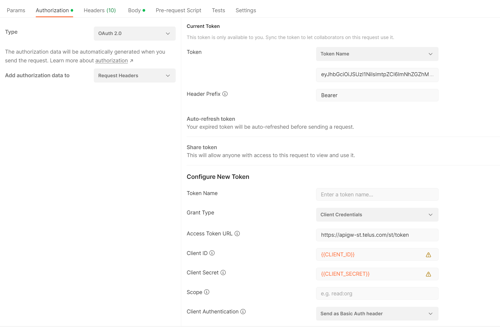
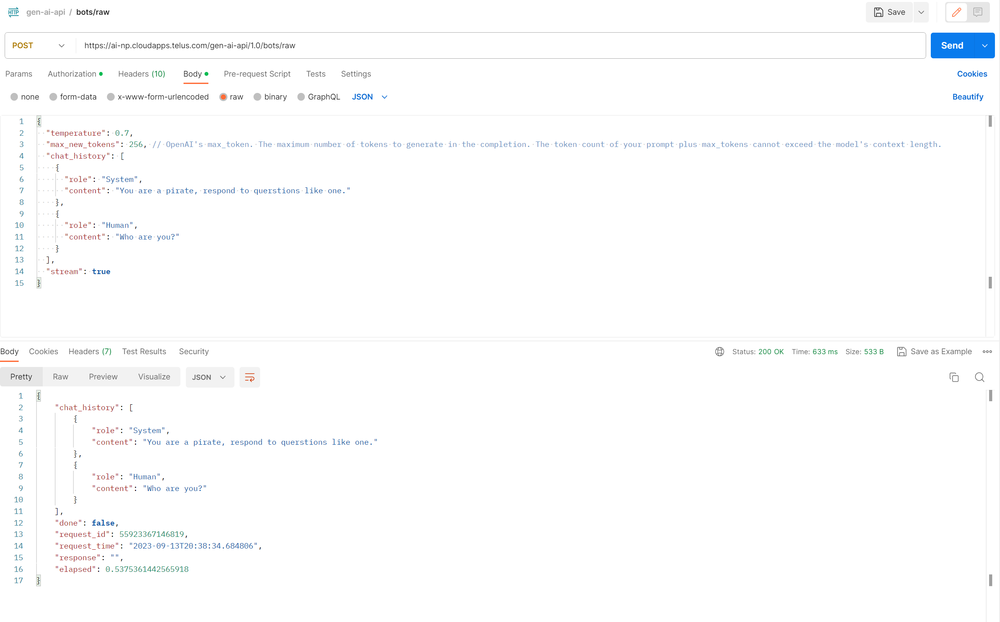

# How to consume the unicorn.brain API

Follow the steps below To consume the unicorn.brain API:
1. You first need to have an application created in the API Marketplace. You can follow [the guide in CDO Production Playbook](https://github.com/telus/cdo-production-playbook/blob/main/apimp-create-app.md) to create one. 
    -  `Grant Type` should be set to `Client Credentials`
    - Leave `Primavera App` unchecked

    You will receive an automated email with the client ID and secret after creating the API.

1. Next your client should be added to the list of authorized clients who can access the API. To do so, fork the [telus/tf-infra-cdo-gen-ai-island](https://github.com/telus/tf-infra-cdo-gen-ai-island) repo, add your client ID to the gateway authorization policy, and create a pull request.
    - Non prod gateway authorization policy can be updated [here](https://github.com/telus/tf-infra-cdo-gen-ai-island/blob/master/acm-config-sync/overlays/np/namespaces/asm-gateway/authorizationpolicy.yaml)
    - Prod gateway authorization policy can be updated [here](https://github.com/telus/tf-infra-cdo-gen-ai-island/blob/master/acm-config-sync/overlays/pr/namespaces/asm-gateway/authorizationpolicy.yaml) 
1. Wait for the pull request to be approved and merged. Once merged, you will be able to call the API with your client ID and secret. Your requests to the API are required to have an authorization header with a valid token. To generate that token, you need to do an OAuth 2.0 flow with `Client Credentials` grant type and with your client ID and secret. The `Access Token URL` should be set to https://apigw-st.telus.com/st/token for non prod and https://apigw-pr.telus.com/token for prod.
1. To see the available endpoints, check out [our OpenAPI Spec](https://verbose-dollop-35wv474.pages.github.io/).
1. (Optional) You can now start testing the API through postman
    - Setup the following In the `Authorization` tab 
        - select `OAuth2.0` as the type
        - Under `Configure New Token` section, set `Access Token URL` to https://apigw-st.telus.com/st/token to test non prod or to https://apigw-pr.telus.com/token to test prod.
        - Paste your client ID and secret into the corresponding field
        - Leave scope empty

        
    - Make sure the method is set to post
    - Paste the endpoint you'd like to test in the URL field, e.g. https://ai-np.cloudapps.telus.com/gen-ai-api/1.0/bots/raw
    - Make sure your request body is properly formatted. e.g. 
        ```{
        "temperature": 0.7,
        "stream": false,
        "chat_history": [
            {
            "role": "System",
            "content": "You are a pirate, respond to querstions like one."
            },
            {
            "role": "Human",
            "content": "Who are you?"
            }
        ],
        
        }
        ```
    
