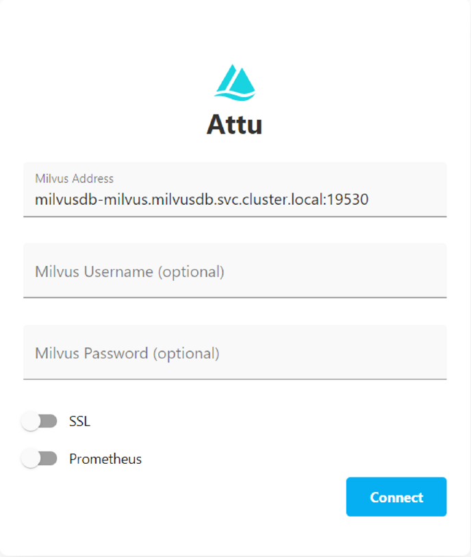

# Unicorn Brain Local Development and Port Forwarding to GCP Milvus

## Prerequisites
- GitHub Account
- GCloud SDK
    - https://cloud.google.com/sdk/docs/install
- Kubernetes
    - Follow instructions here: https://kubernetes.io/docs/tasks/tools/install-kubectl/
    - Download using CURL command via Command Prompt worked for me
- Attu → Milvus DB Local install
    - https://milvus.io/docs/attu_install-package.md

## Goal
- Set up the unicorn.brain repo such that you can test locally and also point to the non-prod
instance of milvusdb to get the latest data
    - [unicorn brain](https://github.com/telus/unicorn.brain/)


## Local Setup
### Step 1: Setting up .env file
- This is an environment file that allows you to easily configure any variables that
change between local and GCP
- Create a copy of .env.template and name it .env
- Get AZURE_OPENAI_API_KEY from Owen, Yasmina or Sara

### Step 2: Install python libraries
    pip install -r requirments.txt


### Step 3: Port forwarding Milvus DB from GCP
- Installing Kubernetes also installs Google Cloud SDK
1. Set up a proxy for GCloud, run the following in Command Prompt(don't use powershell)
    ```
    gcloud config set proxy/type http
    gcloud config set proxy/address webproxystatic-on.tsl.telus.com
    gcloud config set proxy/port 8080

    ```
2. Set up proxy for kubectl
    ```
    set HTTP_PROXY=http://webproxystatic-on.tsl.telus.com:8080/
    set HTTPS_PROXY=http://webproxystatic-on.tsl.telus.com:8080/
    ```
3. Initialize the SDK → You can set the project to cdo-gen-ai-island-np-204b23 or any project. You just need access to cdo-gen-ai-island-np-204b23
    ```
    gcloud init
    ```
4. Set up Kubernetes  
    (1) Verify kubectl is working as expected after installing via command prompt
    ```
    kubectl version
    ```
    - Output should be similar to this with both a Client Version and a Server Version
        ```
        Client Version: version.Info{Major:"1", Minor:"20", GitVersion:"v1.20.2", GitCommit:"faecb196815e248d3ecfb03c680a4507229c2a56", GitTreeState:"clean", BuildDate:"2021-01-13T13:28:09Z", GoVersion:"go1.15.5", Compiler:"gc", Platform:"linux/amd64"}
        Server Version: version.Info{Major:"1", Minor:"16+", GitVersion:"v1.16.15-gke.6000", GitCommit:"b02f5ea6726390a4b19d06fa9022981750af2bbc", GitTreeState:"clean", BuildDate:"2020-11-18T09:16:22Z", GoVersion:"go1.13.15b4", Compiler:"gc", Platform:"linux/amd64"}
        ```
    - If the error looks like this
        
        Install the plugin: https://cloud.google.com/blog/products/containerskubernetes/kubectl-auth-changes-in-gke
    - If the error says that kubectl cannot connect to the server, running the following command to create Kubernetes Configuration Context
        ```
        gcloud container clusters get-credentials gen-ai-gke-nane1 --region northamerica-northeast1 --project cdo-gen-ai-island-np-204b23 
        ```

    (2) Set namespace
    - For prod Milvus
        ```
        kubectl config set-context --current --namespace=milvusdb   
        ```
    - For non-prod Milvus
        ```
        kubectl config set-context --current --namespace=milvusdb-np
        ```

    (3) Get pod for gen-ai api cluster
    ```
    kubectl get pods -n gen-ai-api-np
    ```
    Should see something like this
      

5. Port Forwarding Milvusdb to local
- For milvus namespace
    ```
    kubectl port-forward svc/milvusdb-milvus 19530:19530 -n milvusdb
    ```
- For milvus-np namespace
    ```
    kubectl port-forward svc/milvusdb-milvus 19530:19530 -n milvusdb-np
    ```
- Ensure local Milvus port is mapped to the port on Milvus db in GCP        

6. Now you are connected to the GCP Milvus DB Instance!
- Open another command prompt to run unicorn.brain/src/[main.py](<http://main.py>) (change directory to unicorn.brain/src/)
    ```
    python -m uvicorn main:app --reload
    ```
- Recommend any development to be done in forked repo to avoid polluting the main repo
- You can now use Postman to test your API endpoint
    - The URL will look something like this depending on the endpoint http://127.0.0.1:8000/1.0/bots/onesource
    - If it throws the following error make sure your port-forwarding server to local milvusdb is running.
    

### Access GCP Milvus DB via local Attu
- Port forwarding for milvus namespace
    ```
    kubectl port-forward svc/milvusdb-attu 3000:3000 -n milvusdb
    ```
- Port forwarding for milvus-np namespace
    ```
    kubectl port-forward svc/milvusdb-attu 3000:3000 -n milvusdb-np
    ```
- Open Attu
    - Change Milvus Address to: `milvusdb-milvus.milvusdb.svc.cluster.local:19530`
    - For milvus-np, use milvus address for attu: `milvusdb-milvus.milvusdb-np:19530`
    - Enter credentials
        <div style="max-width: 300px;">
            
        </div>

### Port forwarding Milvusdb from GCP PR  
```
kubectl port-forward milvusdb-milvus-proxy-67699d758d-5wmpt 19530:19530
```
- Create the namespace if it throws namespace error
    ```
    kubectl config set-context --current --namespace=milvusdb-pr
    ```

### Misc. kubectl commands
- Get logs
    - Replace gen-ai-api-np-559864d68f-h88lc with name of pod, may also need permissions set
        ```
        kubectl logs pod/gen-ai-api-np-559864d68f-h88lc -n gen-ai-api-np
        ```
- Get services
    ```
    kubectl get svc -n gen-ai-api-np
    ```